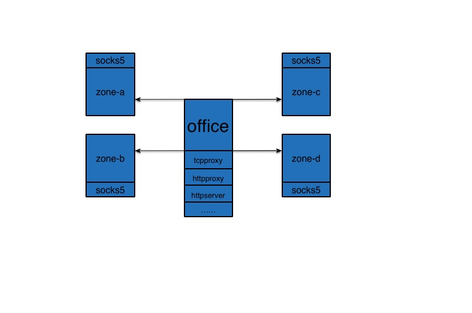

# zoneproxy
zoneproxy to access different network

#purpose
zoneproxy aims to solve the problem in the actual scene, i want to access the server on the different network zones, but our cloud environment only allow me to access the one server called jumpserver. if i want to access more servers, only add a static route on my route table everytime, which is not too convenient:(. Finally, i set socks5 server on each jumpserver and install proxy (tcpproxy、http reverse proxy and http forward proxy)in the office and i just control the link from my office to another zones. architecture as follow:


#install
you have two ways to get binary, choose the best way and enjoy it.

1. choose download binary package
2. compile source code

#build
make sure you have install go:)
````bash
git clone https://github.com/detailyang/zoneproxy
cd zoneproxy
make install #to install deps
make build #build binary
````

#run
##zoneproxy
look at the config file, wish it's easy to understand:) 
````javascript
{
    "tcpproxys": {
        "tp1": {
            "address": ":10000",
            "upstream": "192.168.1.106:3540"
        },
        "tp2": {
            "address": ":10001",
            "upstream": "192.168.1.106:8000"
        }
    },
    "httpproxys": {
        "hp1": {
            "address": ":11000"
        },
        "hp2": {
            "address": ":11001"
        }
    },
    "httpservers": {
        "hs1": {
            "address": ":80",
            "upstreams": {
                "wap.koudaitong.com": "192.168.1.106:8000",
                "twitter.com": "facebook.com"
            }
        }
    },
    "zones": {
        "localhost": {
            "socks5": {
                "address": "192.168.1.106:9999",
                "username": "hello",
                "password": "jack"
            },
            "cidr": "192.168.1.0/24"
        },
        "mybox": {
            "socks5": {
                "address": "192.168.33.10:9999",
                "username": "",
                "password": ""
            },
            "cidr": "192.168.33.0/24"
        }
    },
    "whitelisthosts": "(192.*|beijing-.*|.*\\.com|.*\\.cn|.*\\.org):?[0-9]?"
}
````

````bash
#we use the glog module, it's not firendly to log:(, now just send stdout
bin/zoneproxy -logtostderr=true  -config conf/proxy.json
````
##socks5
socks5 config is easy to understand, i guess.
````javascript
{
    "address": ":9999",
    "username": "hello",
    "password": "jack"
}
````
run the socks5 in your server
````bash
bin/socks5 -logtostderr=true -config=conf/socks5.json
````
#todo
1. better logging
2. better config file fault tolerance
3. provide api to monitor
4. add test code


#finally
it's done , but not perfect. i took two days to write this, i know it's not enough good but it can be used to solve my problem in the actual scene.

i'm ensure that i will update code  and check the issues if anyone have any problem.

welcome to send pull requests to fix bugs:)
